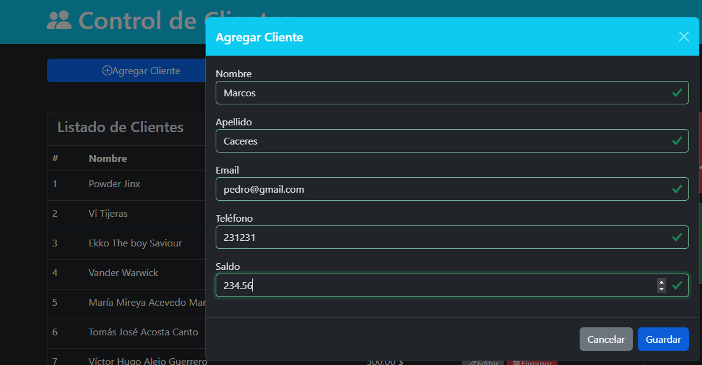

# ClienteControlApp

## Descripción
Este es un sistema web para la gestión de clientes, desarrollado utilizando Java 21, JSP, Servlets y MySQL. El sistema permite realizar operaciones CRUD (Crear, Leer, Actualizar, Eliminar) sobre los registros de clientes, así como otras funcionalidades útiles como la descarga de los registros en formato Excel y un filtro de búsqueda avanzado.
## Características principales

### CRUD de clientes  
Permite gestionar el registro, actualización, eliminación y visualización de clientes.

### Descarga en Excel  
Funcionalidad que permite a los usuarios descargar todos los registros de clientes en formato **Excel**.

### Filtro de búsqueda  
Permite a los usuarios filtrar los clientes según diferentes parámetros (nombre, email, etc.).

### Responsive Design  
La aplicación utiliza **Bootstrap** para asegurar una interfaz amigable y accesible en dispositivos móviles y escritorios.

## Tecnologías utilizadas:

- **Java 21**: Versión de Java utilizada para el desarrollo del backend.
- **JSP (JavaServer Pages)**: Para la creación de páginas web dinámicas.
- **Servlets**: Para manejar la lógica de la aplicación en el servidor y la interacción con el cliente.
- **MySQL**: Base de datos relacional utilizada para almacenar la información de los clientes.
- **Bootstrap**: Framework de CSS para garantizar que la aplicación sea completamente responsiva.
- **Apache POI**: Biblioteca utilizada para generar y exportar archivos Excel con los registros de los clientes.

## Requisitos:

- **Java 21**: Este proyecto está diseñado para ejecutarse con **Java 21**.
- **MySQL**: Debes tener una base de datos **MySQL** configurada para almacenar los registros de los clientes.
- **GlassFish Server, te sugiero el 7.0.15** o cualquier otro servidor compatible con **Servlets** y **JSP** para ejecutar la aplicación.

## Instalación y ejecución:

1. Clona el repositorio:
   ```bash
   git clone https://github.com/jairalmeida/ClienteControlApp.git

2. Configura la base de datos:

Crea una base de datos MySQL llamada control_clientes.
Importa el archivo SQL desde el directorio database/
mysql -u usuario -p control_clientes < database/control_clientes.sql

3. Ejecuta el proyecto
Si usas GlassFish Server, despliega el proyecto en el servidor.
Accede a la aplicación a través de tu navegador en http://localhost:8080/.

##Finalmente, dejo algunas imagenes del sistema web





